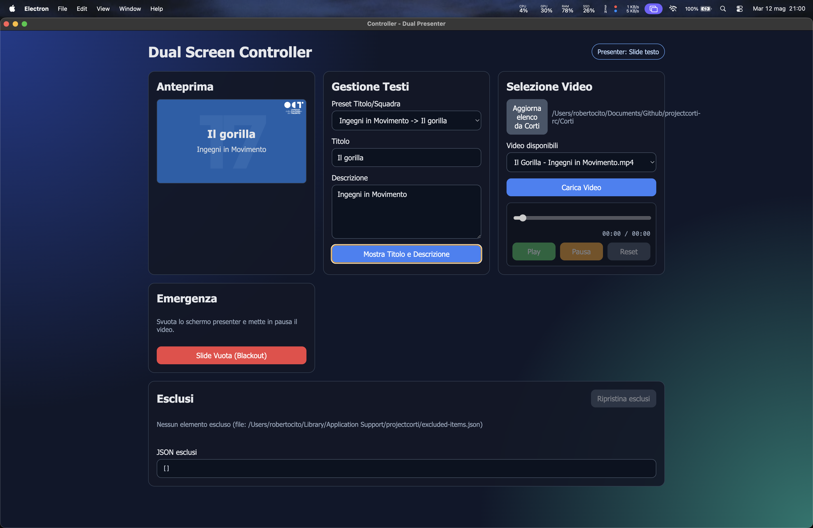
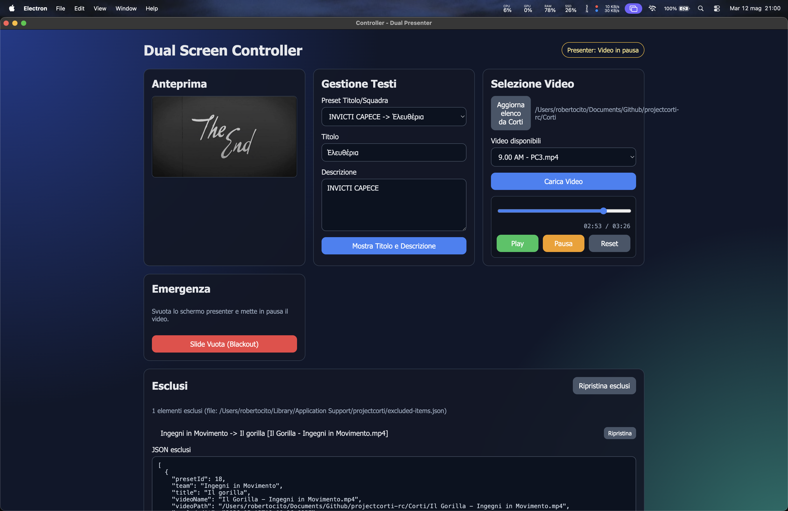
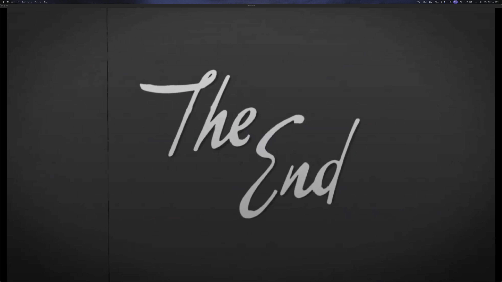
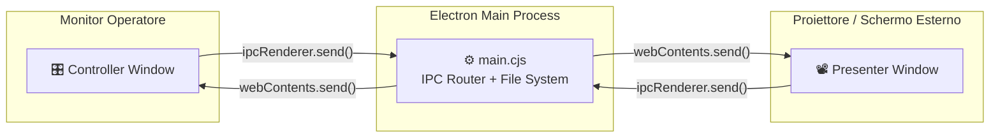
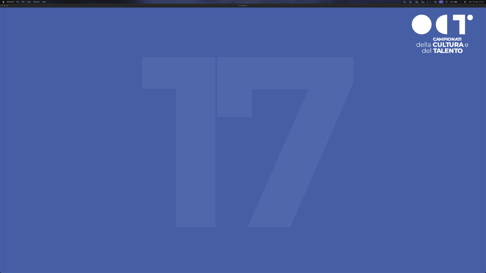
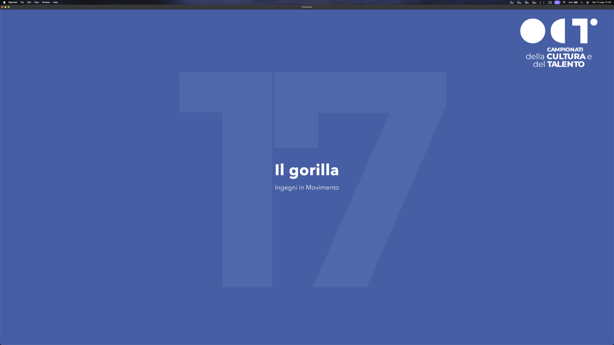
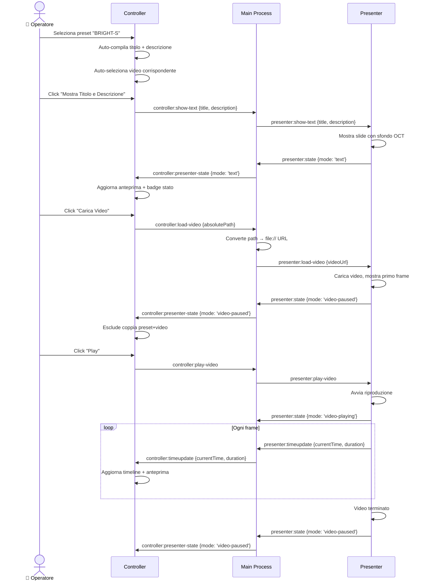

# 🎬 Project Corti — Regia Cortometraggi OCT


**Project Corti** è l'applicazione desktop ufficiale sviluppata per la gestione e la proiezione dei **cortometraggi** durante le finali delle **Olimpiadi della Cultura e del Talento (OCT)**.

Il sistema offre un'architettura a **doppia finestra (Controller + Presenter)** che consente all'operatore di regia di controllare in tempo reale ciò che viene proiettato al pubblico: slide con titolo e squadra, riproduzione video dei corti, timeline interattiva e blackout d'emergenza — il tutto da una postazione dedicata, mentre il proiettore mostra esclusivamente la finestra Presenter a schermo intero.

> [!WARNING]
> **Copyright & Licenza:** Questo software è protetto da diritto d'autore (All Rights Reserved). Non è consentita la copia, distribuzione, modifica, o alcun uso commerciale o personale del codice senza esplicita autorizzazione.

> [!IMPORTANT]
> **Stato del Progetto:** L'applicazione è stata impiegata con successo durante le finali della competizione OCT, gestendo la proiezione di oltre 30 cortometraggi in sequenza senza interruzioni, con controllo live dalla regia.

---

#### 🔗 Link Utili
* **Sito Ufficiale OCT:** [olimpiadidellacultura.it](https://www.olimpiadidellacultura.it/)

---

#### 📑 Indice
*   [🏆 Il Ruolo dell'Applicazione](#-il-ruolo-dellapplicazione)
*   [🖥️ Architettura Dual Screen](#️-architettura-dual-screen)
*   [🎛️ Finestra Controller](#️-finestra-controller)
*   [📽️ Finestra Presenter](#️-finestra-presenter)
*   [🔄 Comunicazione IPC](#-comunicazione-ipc)
*   [🎯 Matching Intelligente Preset ↔ Video](#-matching-intelligente-preset--video)
*   [📂 Raccolta Video dalla Cartella Corti](#-raccolta-video-dalla-cartella-corti)
*   [🚫 Sistema di Esclusione](#-sistema-di-esclusione)
*   [💻 Tech Stack](#-tech-stack)
*   [⚙️ Struttura dei File](#️-struttura-dei-file)
*   [☕ Sviluppo Locale](#-sviluppo-locale)

---

#### 🏆 Il Ruolo dell'Applicazione

Durante i giorni delle finali, le squadre partecipanti presentano al pubblico i propri **cortometraggi**, opere audiovisive realizzate come prova creativa della competizione. L'operatore di regia deve gestire la proiezione di ciascun corto in sequenza, introducendo ogni video con una **slide di presentazione** (titolo del corto + nome della squadra) e successivamente avviando la **riproduzione del video** sullo schermo del proiettore.

L'applicazione funge da **cabina di regia digitale** per:

1.  **Presentazione Squadra e Titolo:** L'operatore seleziona un preset o inserisce manualmente titolo e descrizione, che vengono proiettati su sfondo personalizzato OCT.

    

2.  **Riproduzione Cortometraggio:** Il video viene caricato, avviato, messo in pausa o cercato tramite una timeline interattiva, mentre il Presenter lo riproduce a schermo intero.

    

3.  **Anteprima Live:** Il Controller include un monitor di anteprima che replica in tempo reale ciò che il pubblico vede sullo schermo Presenter, consentendo all'operatore di verificare ogni azione prima e durante la proiezione.

    

4.  **Blackout d'Emergenza:** Con un solo clic, l'operatore può svuotare lo schermo Presenter e mettere in pausa qualsiasi contenuto attivo, mostrando lo sfondo OCT vuoto.

---

#### 🖥️ Architettura Dual Screen

Il cuore dell'applicazione è il pattern **Controller-Presenter**, implementato tramite due finestre Electron indipendenti che comunicano attraverso il processo main via **IPC (Inter-Process Communication)**:



*   **Controller Window** — Viene aperta sul monitor principale dell'operatore. Contiene tutti i comandi: selezione preset, input titolo/descrizione, selezione e riproduzione video, timeline, blackout e gestione esclusioni.
*   **Presenter Window** — Viene posizionata automaticamente sullo **schermo esterno** (il secondo display collegato), occupandone l'intera area. Mostra esclusivamente il contenuto proiettato: slide di testo su sfondo OCT oppure il video a schermo intero.

> [!NOTE]
> Se è collegato un solo monitor, entrambe le finestre si aprono sullo stesso display. In produzione (durante l'evento), il Presenter si posiziona automaticamente sul secondo monitor grazie alla rilevazione di `screen.getAllDisplays()`.

---

#### 🎛️ Finestra Controller

La finestra Controller (`controller.html` + `controller.js` + `controller.css`) è il pannello di comando dell'operatore e include le seguenti sezioni:


**1. Header con Stato Presenter**
Un badge dinamico nell'angolo superiore mostra in tempo reale lo stato del Presenter:
| Stato | Colore | Significato |
|---|---|---|
| `in attesa` | Grigio | Nessun contenuto attivo |
| `Slide testo` | Blu | Viene mostrata una slide con titolo e descrizione |
| `Video in pausa` | Giallo | Un video è caricato ma in pausa |
| `Video in riproduzione` | Verde | Un video è attualmente in riproduzione |
| `Slide vuota` | Rosso | Blackout attivo |

**2. Anteprima (Preview Stage)**
Un riquadro 16:9 che replica esattamente ciò che viene visualizzato sul Presenter. L'anteprima mostra:
- Lo sfondo OCT con testo sovrapposto in modalità `text`
- Il video (in muto) sincronizzato con il Presenter in modalità `video-playing` / `video-paused`
- Lo sfondo OCT vuoto in modalità `blackout`

**3. Gestione Testi**
- **Preset Titolo/Squadra:** Un menu a tendina precompilato con tutte le 33 squadre finaliste e i rispettivi titoli dei corti. Selezionando un preset, i campi titolo e descrizione vengono compilati automaticamente e il video corrispondente viene selezionato automaticamente nell'elenco video.
- **Titolo e Descrizione:** Campi di testo editabili manualmente per inserimenti personalizzati.
- **Mostra Titolo e Descrizione:** Invia la slide di testo al Presenter.

**4. Selezione Video**
- **Aggiorna elenco da Corti:** Scansiona la cartella `Corti/` alla ricerca di file video supportati (`.mp4`, `.webm`, `.mov`).
- **Video disponibili:** Menu a tendina con tutti i video trovati, filtrati dagli elementi già esclusi.
- **Carica Video:** Invia il video selezionato al Presenter e lo prepara per la riproduzione. Al caricamento, la coppia preset+video viene automaticamente **esclusa** dall'elenco per evitare doppie proiezioni.

**5. Controlli di Riproduzione**
- **Timeline:** Slider interattivo che mostra il progresso del video in tempo reale. L'operatore può trascinare lo slider per fare seek su un punto specifico del video.
- **Display Tempo:** Indicatori `currentTime / duration` in formato `MM:SS`.
- **Play / Pausa / Reset:** Pulsanti per controllare la riproduzione del video sul Presenter.

**6. Emergenza — Blackout**
Un pulsante rosso "Slide Vuota (Blackout)" che svuota immediatamente lo schermo Presenter, interrompendo qualsiasi contenuto attivo.

**7. Pannello Esclusi**
Mostra l'elenco delle coppie preset+video già utilizzate (escluse). Ogni elemento può essere **ripristinato** singolarmente o in blocco. Lo stato degli esclusi è persistente: viene salvato su disco in formato JSON nella cartella dati utente dell'applicazione.

---

#### 📽️ Finestra Presenter

La finestra Presenter (`presenter.html` + `presenter.js` + `presenter.css`) è la finestra che veniva proiettata tramite il proiettore per i ragazzi in sala durante le finali. Proprio per questo motivo è stata progettata con un'interfaccia intenzionalmente minimale e priva di qualsiasi elemento di controllo: nessun pulsante, nessun menu, nessuna UI visibile — esclusivamente il contenuto proiettato (slide di presentazione o video del cortometraggio) su sfondo pulito, così da offrire al pubblico un'esperienza visiva professionale e priva di distrazioni.

**Modalità di visualizzazione:**

| Modalità | Descrizione | Sfondo |
|---|---|---|
| `blackout` | Schermo vuoto con sfondo OCT | Immagine sfondo OCT (`sfondo.png`) |
| `text` | Slide con titolo (h1) e descrizione (p) centrati | Immagine sfondo OCT |
| `video-paused` | Video caricato, fermo sul frame corrente | Nero |
| `video-playing` | Video in riproduzione a schermo intero | Nero |





Il Presenter **non gestisce alcuna logica di input**: riceve comandi esclusivamente via IPC dal processo main e pubblica il proprio stato (modalità corrente, `currentTime`, `duration`) verso il Controller per alimentare l'anteprima e la timeline.

---

#### 🔄 Comunicazione IPC

L'intero flusso di comunicazione tra Controller, Main Process e Presenter avviene tramite **Electron IPC** con isolamento del contesto (`contextIsolation: true`) e preload scripts dedicati.

**Preload Controller** (`preload-controller.cjs`):
Espone l'oggetto `window.controllerApi` con i seguenti metodi:

| Metodo | Tipo | Descrizione |
|---|---|---|
| `getCortiVideos()` | `invoke` (async) | Richiede la lista dei video dalla cartella Corti |
| `loadExcludedState()` | `invoke` (async) | Carica lo stato degli esclusi dal file JSON |
| `saveExcludedState(items)` | `invoke` (async) | Salva lo stato degli esclusi su file JSON |
| `showTextSlide(payload)` | `send` | Invia una slide di testo al Presenter |
| `blackout()` | `send` | Invia il comando blackout |
| `loadVideo(payload)` | `send` | Carica un video nel Presenter |
| `playVideo()` | `send` | Avvia la riproduzione |
| `pauseVideo()` | `send` | Mette in pausa la riproduzione |
| `seekVideo(time)` | `send` | Salta a un tempo specifico nel video |
| `onPresenterState(cb)` | `on` (listener) | Riceve aggiornamenti sullo stato del Presenter |
| `onTimeUpdate(cb)` | `on` (listener) | Riceve aggiornamenti sulla posizione temporale del video |

**Preload Presenter** (`preload-presenter.cjs`):
Espone l'oggetto `window.presenterApi` con i seguenti metodi:

| Metodo | Tipo | Descrizione |
|---|---|---|
| `onShowText(cb)` | `on` (listener) | Riceve il comando per mostrare una slide di testo |
| `onBlackout(cb)` | `on` (listener) | Riceve il comando di blackout |
| `onLoadVideo(cb)` | `on` (listener) | Riceve il comando per caricare un video |
| `onPlayVideo(cb)` | `on` (listener) | Riceve il comando di play |
| `onPauseVideo(cb)` | `on` (listener) | Riceve il comando di pausa |
| `onSeekVideo(cb)` | `on` (listener) | Riceve il comando di seek |
| `sendState(payload)` | `send` | Pubblica lo stato corrente del Presenter verso il Controller |
| `sendTimeUpdate(payload)` | `send` | Pubblica `currentTime` e `duration` del video verso il Controller |

**Flusso tipico — Proiezione di un corto:**



---

#### 🎯 Matching Intelligente Preset ↔ Video

Il sistema implementa un algoritmo di **fuzzy matching bidirezionale** per associare automaticamente ogni preset (squadra + titolo) al file video corrispondente nella cartella Corti.

**Come funziona:**

1.  **Normalizzazione del testo** (`normalizeText`): Rimuove accenti (via `NFD` + regex diacritici), converte in lowercase e sostituisce i caratteri non alfanumerici con spazi.
2.  **Tokenizzazione** (`tokenize`): Spezza il testo normalizzato in singole parole.
3.  **Scoring** (`scoreVideoAgainstPreset`): Ogni video riceve un punteggio rispetto a ciascun preset, basato su:

| Criterio | Punteggio |
|---|---|
| Il nome del video contiene l'intero titolo del corto | +1000 |
| Il nome del video contiene l'intero nome della squadra | +700 |
| Ogni token del titolo trovato nel nome del video | +50 |
| Ogni token del nome squadra trovato nel nome del video | +35 |

4.  **Selezione bidirezionale:**
    - Quando l'operatore **seleziona un preset**, il sistema cerca automaticamente il video con lo score più alto (`selectBestVideoByPreset`).
    - Quando l'operatore **seleziona un video**, il sistema cerca il preset corrispondente (`selectPresetByVideo`).

> [!TIP]
> Questo matching automatico velocizza enormemente la regia durante l'evento: l'operatore seleziona una squadra dal menu e sia il titolo, la descrizione che il video vengono precompilati in un solo click.

---

#### 📂 Raccolta Video dalla Cartella Corti

Il processo main (`main.cjs`) implementa una funzione `getAllVideoFiles()` che effettua una scansione **ricorsiva** della cartella `Corti/` (posizionata nella root del progetto) alla ricerca di tutti i file video con estensione supportata.

**Estensioni supportate:** `.mp4`, `.webm`, `.mov`

Per ogni video trovato, il sistema restituisce:
- `name` — Nome del file
- `absolutePath` — Percorso assoluto sul filesystem
- `relativePath` — Percorso relativo rispetto alla cartella Corti

I risultati vengono **ordinati alfabeticamente** per `relativePath`. Quando il Controller richiede la lista video (tramite `videos:get-from-corti`), il main process restituisce l'elenco completo, che viene poi filtrato dal Controller rimuovendo i video già esclusi.

> [!NOTE]
> La cartella `Corti/` contiene i file video originali delle squadre. I nomi dei file seguono generalmente il formato `Titolo Corto - Nome Squadra.mp4`, il che agevola il funzionamento dell'algoritmo di matching.

---

#### 🚫 Sistema di Esclusione

Per evitare che un corto venga proiettato due volte durante l'evento, il sistema implementa un meccanismo di **esclusione automatica e persistente**:

1.  **Esclusione Automatica:** Ogni volta che l'operatore clicca "Carica Video", la coppia `(presetId, videoPath)` viene aggiunta alla lista degli esclusi.
2.  **Persistenza su Disco:** La lista viene salvata come file JSON (`excluded-items.json`) nella cartella `userData` di Electron, sopravvivendo al riavvio dell'applicazione.
3.  **Filtro Attivo:** Sia i preset nel menu a tendina che i video nell'elenco vengono filtrati in base allo stato degli esclusi. L'operatore vede solo gli elementi non ancora proiettati.
4.  **Ripristino:** L'operatore può ripristinare un singolo elemento o l'intera lista degli esclusi dal pannello dedicato.

**Formato JSON di ciascun elemento escluso:**
```json
{
  "presetId": 3,
  "team": "CS RICREDE",
  "title": "La Frequenza Del Potere",
  "videoName": "La Frequenza Del Potere - CS RICREDE.mov",
  "videoPath": "/path/to/Corti/La Frequenza Del Potere - CS RICREDE.mov",
  "excludedAt": "2026-05-12T18:30:00.000Z"
}
```

---

#### 💻 Tech Stack

Il progetto è un'applicazione desktop multi-piattaforma costruita con tecnologie web moderne, pacchettizzata tramite Electron:

*   **[Electron 37](https://www.electronjs.org/):** Framework per applicazioni desktop cross-platform. Gestisce la creazione delle finestre, la comunicazione IPC, l'accesso al filesystem e il posizionamento multi-monitor.
*   **JavaScript (ES2020):** Logica applicativa sia lato renderer (Controller e Presenter) che lato main process. Nessun framework UI nel renderer principale — vanilla JS puro per prestazioni massime nella gestione dei video.
*   **HTML5 + CSS3:** Interfacce Controller e Presenter con layout responsive, CSS variables, glassmorphism e gradients per il pannello Controller. La finestra Presenter usa uno stile minimale full-screen con `clamp()` per la tipografia responsive.
*   **[Vite 8](https://vite.dev/) + [React 19](https://react.dev/):** Configurati nel progetto (scaffolding iniziale), ma il runtime principale della doppia finestra Controller-Presenter utilizza file HTML/JS statici caricati direttamente da Electron via `loadFile()`.
*   **Node.js (CommonJS):** I file `main.cjs`, `preload-controller.cjs` e `preload-presenter.cjs` utilizzano il sistema di moduli CommonJS, come richiesto da Electron per il processo main e i preload scripts.
*   **[ESLint 9](https://eslint.org/):** Linting del codice JavaScript/JSX con plugin dedicati per React Hooks e React Refresh.

---

#### ⚙️ Struttura dei File

```
projectcorti-rc/
├── Corti/                          # 📂 Cartella con i file video dei cortometraggi
│   ├── World War Word - BRIGHT-S.mp4
│   ├── La Frequenza Del Potere - CS RICREDE.mov
│   ├── ...                         # ~33 video delle squadre finaliste
│   └── Ἐλευθέρια - INVICTI CAPECE.mp4
│
├── images/                         # 🖼️ Screenshot per la documentazione
│   ├── controller.png
│   ├── controller_with_text.png
│   ├── controller_with_video.png
│   ├── presenter_empty.png
│   ├── presenter_with_text.png
│   └── presenter_with_video.png
│
├── public/                         # Asset statici (favicon, icone SVG)
│   ├── favicon.svg
│   └── icons.svg
│
├── src/                            # 🔧 Scaffolding Vite + React (non usato dal runtime Electron)
│   ├── assets/
│   │   ├── sfondo.png              # ⭐ Sfondo ufficiale OCT usato dal Presenter
│   │   ├── hero.png
│   │   ├── react.svg
│   │   └── vite.svg
│   ├── App.jsx
│   ├── App.css
│   ├── main.jsx
│   └── index.css
│
├── main.cjs                        # ⚡ Processo main Electron (finestre, IPC, filesystem)
├── preload-controller.cjs          # 🔒 Preload script — bridge API per il Controller
├── preload-presenter.cjs           # 🔒 Preload script — bridge API per il Presenter
│
├── controller.html                 # 🎛️ Interfaccia HTML del Controller
├── controller.js                   # 🎛️ Logica JS del Controller (preset, matching, esclusioni)
├── controller.css                  # 🎛️ Stili del Controller (dark theme, glassmorphism)
│
├── presenter.html                  # 📽️ Interfaccia HTML del Presenter
├── presenter.js                    # 📽️ Logica JS del Presenter (display, playback, stato)
├── presenter.css                   # 📽️ Stili del Presenter (fullscreen, sfondo OCT)
│
├── index.html                      # Entry point Vite/React (non usato da Electron)
├── package.json                    # Dipendenze e script npm
├── vite.config.js                  # Configurazione Vite
├── eslint.config.js                # Configurazione ESLint
└── README.md                       # 📖 Questo file
```

---

#### ☕ Sviluppo Locale

**Requisiti:**
*   [Node.js](https://nodejs.org/) (LTS consigliato)
*   [npm](https://www.npmjs.com/) (incluso con Node.js)
*   Un secondo monitor/proiettore (opzionale, per testare il dual-screen)

**Installazione dipendenze:**
```bash
npm install
```

**Avvio dell'applicazione Electron:**
```bash
npm run electron:start
```
L'applicazione aprirà due finestre: il **Controller** sul monitor principale e il **Presenter** sul secondo display (se disponibile).

> [!TIP]
> Per sviluppo e testing su un singolo monitor, entrambe le finestre si apriranno sullo stesso schermo. Puoi affiancarle per simulare il setup dual-screen.

**Avvio del dev server Vite** (solo per lo scaffolding React, non necessario per il runtime Electron):
```bash
npm run dev
```

**Preparazione della cartella Corti:**
Posiziona i file video dei cortometraggi (`.mp4`, `.webm`, `.mov`) nella cartella `Corti/` alla root del progetto. L'applicazione li rileverà automaticamente all'avvio o al click di "Aggiorna elenco da Corti".
